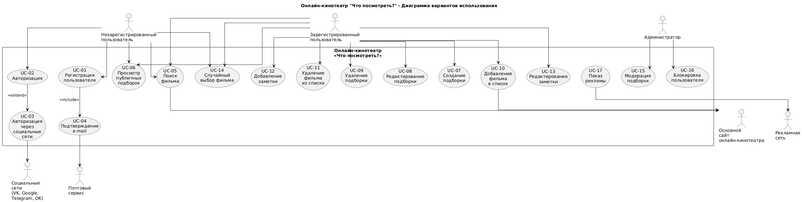
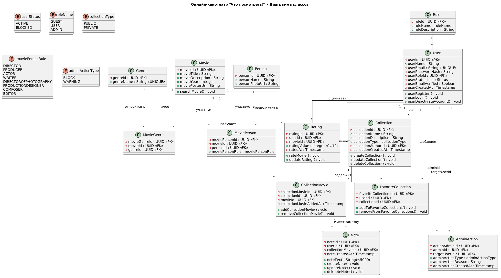
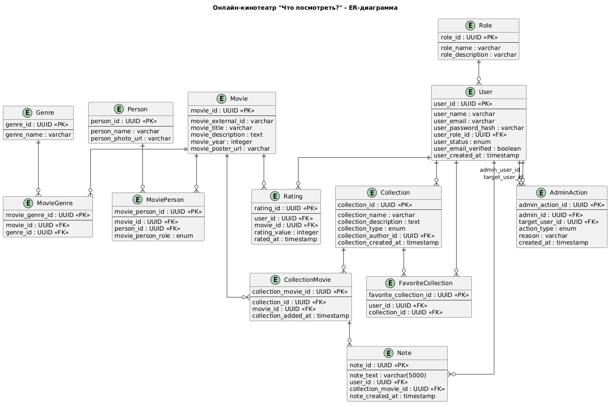

**Онлайн-кинотеатр «Что посмотреть?»**

Выпуск 1.0

Спецификация требований к программному обеспечению

Версия 1.3 approved

**Содержание**

- [История изменений](#история-изменений)
- [1. Введение](#1-введение)
  - [1.1. Назначение](#11-назначение)
  - [1.2. Область применения](#12-область-применения)
  - [1.3. Определения, акронимы и сокращения](#13-определения-акронимы-и-сокращения)
  - [1.4. Ссылки](#14-ссылки)
- [2. Общее описание](#2-общее-описание)
  - [2.1. Видение продукта](#21-видение-продукта)
  - [2.2. Перспективы продукта](#22-перспективы-продукта)
  - [2.3. Взаимодействие продукта с другими продуктами и компонентами](#23-взаимодействие-продукта-с-другими-продуктами-и-компонентами)
  - [2.4. Классы и характеристики пользователей](#24-классы-и-характеристики-пользователей)
  - [2.5. Ограничения разработки и реализации](#25-ограничения-разработки-и-реализации)
  - [2.6. Допущения и зависимости](#26-допущения-и-зависимости)
- [3. Функциональные требования](#3-функциональные-требования)
- [4. Нефункциональные требования](#4-нефункциональные-требования)
- [Приложения](#приложения)
  - [Приложение A. Результаты интервью](#приложение-a-результаты-интервью)
  - [Приложение B. Обзор вариантов использования](#приложение-b-обзор-вариантов-использования)
  - [Приложение C. Сценарии использования](#приложение-c-сценарии-использования)
  - [Приложение D. Диаграмма классов](#приложение-d-диаграмма-классов)
  - [Приложение E. ER-диаграмма](#приложение-e-er-диаграмма)
  - [Приложение F. Описание программного интерфейса](#приложение-f-описание-программного-интерфейса)

## История изменений

(изменения вносятся по порядку)

<table><thead><tr><th>
<strong>Специалист</strong>
</th><th>
<strong>Версия</strong>
</th><th>
<strong>Дата</strong>
</th><th>
<strong>Описание</strong>
</th></tr></thead><tbody><tr><td>
Белых И.А.
</td><td>
1.0
</td><td>
04.03.2026
</td><td>
Документ создан:
<ul><li>Добавлены ответы на вопросы, полученные в ходе интервью (см. Приложение A. Результаты интервью)</li><li>Добавлена диаграмма вариантов использования (см. Приложение B. Обзор вариантов использования)</li><li>Добавлено описание основных вариантов использования (см. Приложение C. Сценарии использования)</li><li>Заполнены разделы (см. 1. Введение, 2. Общее описание)</li><li>Добавлены шаблоны таблиц (см. 3. Функциональные требования, 4. Нефункциональные требования, Приложение D. Диаграмма классов)-не заполнены</li></ul></td></tr><tr><td>
Белых И.А.
</td><td>
1.1
</td><td>
05.03.2026
</td><td><ul><li>Скорректирована линия от главного актора до варианта использования на связь ассоциацию (см. Приложение B. Обзор вариантов использования)</li><li>Скорректирована линия include, extend на пунктирную ((см. Приложение B. Обзор вариантов использования)</li><li>Добавлено описание остальных вариантов использования (см. Приложение C. Сценарии использования)</li><li>Заполнен раздел ФТ, НФТ (см. 3. Функциональные требования, 4. Нефункциональные требования)</li></ul></td></tr><tr><td>
Белых И.А.
</td><td>
1.2
</td><td>
09.03.2026
</td><td><ul><li>Добавлена диаграмма классов, описание сущностей (см. Приложение D. Диаграмма классов)</li><li>Добавлен ER-диаграмма (см. Приложение E. ER-диаграмма)</li></ul></td></tr><tr><td>
Белых И.А.
</td><td>
1.3
</td><td>
10.03.2026
</td><td><ul><li>Добавлена спецификация Open API (см. Приложение F. Описание программного интерфейса)</li></ul></td></tr></tbody></table>

## 1. Введение

### 1.1. Назначение

Эта спецификация требований к ПО описывает функциональные и нефункциональные требования к веб-сайту онлайн-кинотеатра «Что посмотреть?».

Документ разработан на основе интервью с заказчиком версия 1.1 от 27.02.2026 (см. Приложение A. Результаты интервью).

Этот документ предназначен для команды, которая будут реализовывать и проверять корректность работы приложения.

Кроме специально обозначенных случаев, все указанные здесь требования имеют высокий приоритет и приписаны к выпуску 1.0.

### 1.2. Область применения

Спецификация распространяется на веб-сайт онлайн-кинотеатр «Что посмотреть?». Система представляет собой каталогизатор фильмов и сериалов, позволяющий пользователям вести личные списки просмотренного и запланированного к просмотру контента, создавать публичные и приватные подборки, а также оставлять к ним заметки.

Система взаимодействует с существующим сайтом онлайн-кинотеатра заказчика для получения метаданных фильмов (название, жанр, актеры и т.д.) и перенаправления пользователей для просмотра контента. На первом этапе монетизация сервиса планируется только за счет размещения рекламы, запуск стриминга (потокового видео) на данной платформе не планируется.

### 1.3. Определения, акронимы и сокращения

Таблица 1-Термины и определения

| Термин | Определение |
| --- | --- |
| Фильм / Сериал | Единица контента в системе. Характеризуется метаданными (название, год, жанр, постер и пр.), получаемыми с основного сайта кинотеатра. |
| Подборка | Сущность, представляющая собой список фильмов и/или сериалов, объединенных пользователем по какому-либо признаку. Имеет название, тип доступа (публичный/приватный) и автора. |
| Заметка | Текстовый комментарий (до 5000 символов), который авторизованный пользователь может оставить к фильму в рамках конкретной подборки. |
| Основной сайт | Существующий сайт онлайн-кинотеатра заказчика, на котором происходит непосредственно просмотр видео. |
| API | Application Programming Interface (программный интерфейс приложения) для взаимодействия с основным сайтом. |

### 1.4. Ссылки

При разработке системы необходимо руководствоваться следующими документами и нормативными актами:

- [Федеральный закон от 27.07.2006 г. № 152-ФЗ “О персональных данных”](http://www.kremlin.ru/acts/bank/24154);
- Интервью с заказчиком. WTW-platform, версия 1.1 от 27.02.2026. (см. Приложение A. Результаты интервью).

## 2. Общее описание

### 2.1. Видение продукта

Веб-сайт «Что посмотреть?» призван решить проблему навигации и выбора контента для пользователей онлайн-кинотеатра с целью увеличения аудитории и вовлеченности пользователей. Основная функциональность продукта заключается в предоставлении инструментов для персональной каталогизации фильмов и сериалов.

- Продукт позволит авторизованным пользователям:
- Вести списки просмотренных фильмов/сериалов.
- Создавать гибкие тематические подборки контента (публичные и приватные).
- Делать текстовые заметки к фильмам в рамках подборок.
- Получать случайный фильм для просмотра из своей подборки.
- Изучать и взаимодействовать с публичными подборками других пользователей.
- Для неавторизованных пользователей (гостей) будет доступен поиск и просмотр публичных подборок, получение случайного фильма, что призвано повысить узнаваемость платформы и стимулировать регистрацию.

### 2.2. Перспективы продукта

Версия 1.0 системы, описываемая в данной спецификации, является базовой и направлена на реализацию ключевого функционала.

В будущих версиях продукта не исключается добавление следующих возможностей:

- Социальные функции: подписка на авторов подборок, лайки, комментарии к подборкам.
- Расширенная статистика: по просмотренному контенту, любимым жанрам и актерам.
- Система оценок и рецензий: возможность ставить оценки и писать развернутые отзывы к фильмам.

### 2.3. Взаимодействие продукта с другими продуктами и компонентами

Система «Что посмотреть?» функционирует в следующем окружении:

- Пользователь: взаимодействует с системой через веб-интерфейс для выполнения своих задач (поиск, создание подборок и т.д.).
- Администратор: взаимодействует с системой через веб-интерфейс (административная-панель) для модерации контента и управления пользователями.
- Основной сайт онлайн-кинотеатра:
- API каталога: система обращается к API основного сайта для поиска и получения метаданных фильмов/сериалов (название, постер, жанр, год, актеры).
- Перенаправление: Система перенаправляет пользователя на страницу фильма/сериала на основном сайте для его просмотра.
- Сторонние сервисы аутентификации: интеграция с API социальных сетей (VK, Telegram, OK) для упрощенной регистрации и входа.
- Почтовый сервис (SMTP-сервер): используется системой для отправки отправка ссылки для подтверждения email-адреса при регистрации пользователя через логин и пароль.
- Рекламная сеть: интеграция с внешними системами (например, Яндекс.Директ) для отображения рекламных объявлений на страницах сайта. Вызов рекламного кода происходит при загрузке страниц, доход от показов является основной моделью монетизации, заявленной заказчиком.
- База данных разрабатываемой системы: хранит пользовательские данные (профили, подборки, заметки, связи с фильмами).

### 2.4. Классы и характеристики пользователей

Таблица 2-Характеристики пользователей

| **Класс** | **Характеристика** |
| --- | --- |
| Пользователь | Физическое лицо, посещающее сайт. Может быть авторизованным или неавторизованным (гость). |
| Авторизованный пользователь | Пользователь, прошедший процедуру аутентификации (регистрацию/вход) и имеющий доступ к расширенному функционалу. |
| Администратор | Привилегированный пользователь, отвечающий за модерацию контента и управление пользователями. |

### 2.5. Ограничения разработки и реализации

На систему накладываются следующие ограничения:

- Технологические:
- Клиентская часть должна корректно работать в современных версиях браузеров.
- Серверная часть должна обеспечивать возможность горизонтального масштабирования.
- Правовые:
- Система должна обеспечивать защиту персональных данных в соответствии с требованиями Федерального закона № 152-ФЗ «О персональных данных».
- Временные:
- Необходимо предусмотреть плановые окна технического обслуживания с общей продолжительностью не более 1% от годового времени (что соответствует доступности 99%).
- Интеграционные:
- Архитектура системы зависит от доступности и стабильности API основного сайта онлайн-кинотеатра.
- Формат и состав данных о фильмах определяется этим API.

### 2.6. Допущения и зависимости

При разработке системы мы исходим из следующих допущений:

- Доступность API: предполагается, что API основного сайта онлайн-кинотеатра для получения метаданных фильмов является стабильным, документированным и будет доступен в течение всего жизненного цикла разрабатываемого продукта.
- Наполнение каталога: подразумевается, что на основном сайте присутствует достаточная база фильмов и сериалов для обеспечения интереса пользователей к новому сервису.
- Нагрузка на старте: ожидаемая нагрузка в 5000 пользователей в час на старте не требует мгновенной реализации сложных механизмов кеширования, но архитектура должна позволить их внедрение в будущем.

## 3. Функциональные требования

Таблица 3-Функциональные требования

| ID                                        | Требование | Источник                                                                                                                       | Приоритет | Тип    |
|-------------------------------------------|------------|--------------------------------------------------------------------------------------------------------------------------------|-----------|--------|
| F-1 Роли и пользователи                   |            |                                                                                                                                |           |        |
| FR-1.1                                    |            | Система должна поддерживать роли с разными правами: Администратор, зарегистрированный незарегистрированный пользователь        | Интервью  | Must   |
| FR-1.2                                    |            | Система должна предоставлять возможность использования системы в гостевом режиме (без регистрации)                             | Интервью  | Must   |
| F-2 Регистрация и авторизация             |            |                                                                                                                                |           |        |
| FR-2.1                                    |            | Система должна обеспечивать регистрацию пользователя по e-mail и паролю                                                        | Интервью  | Must   |
| FR-2.2                                    |            | Система должна обеспечивать регистрацию пользователя через социальные сети (VK, Telegram, OK)                                  | Интервью  | Must   |
| FR-2.3                                    |            | Система должна выполнять подтверждение e-mail при регистрации                                                                  | Интервью  | Must   |
| FR-2.4                                    |            | Система должна переводить пользователя в личный кабинет после успешной авторизации                                             | Интервью  | Must   |
| FR-2.5                                    |            | Система должна отображать сообщение об ошибке при не успешной авторизации                                                      | Интервью  | Must   |
| F-3 Подборки (публичные и приватные)      |            |                                                                                                                                |           |        |
| FR-3.1                                    |            | Система должна позволять гостевому пользователю просматривать публичные подборки                                               | Интервью  | Must   |
| FR-3.2                                    |            | Система должна позволять зарегистрированному пользователю создавать подборки                                                   | Интервью  | Must   |
| FR-3.3                                    |            | Система должна поддерживать два типа подборок: публичные и приватные                                                           | Интервью  | Must   |
| FR-3.4                                    |            | Система должна позволять изменять тип подборки (публичная/приватная)                                                           | Интервью  | Must   |
| FR-3.5                                    |            | Система должна обеспечивать уникальность названия подборки в рамках одного пользователя                                        | Интервью  | Must   |
| FR-3.6                                    |            | Система должна позволять менять тип подборки (публичная ↔ приватная)                                                           | Интервью  | Must   |
| FR-3.7                                    |            | Система должна позволять редактировать название подборки                                                                       | Интервью  | Must   |
| FR-3.8                                    |            | Система должна позволять удалять подборки                                                                                      | Интервью  | Must   |
| FR-3.9                                    |            | Система должна не ограничивать кол-во подборок у пользователя                                                                  | Интервью  | Must   |
| FR-3.10                                   |            | Система должна отображать публичные подборки с возможностью поиска по названию, автору и тегам                                 | Интервью  | Must   |
| FR-3.11                                   |            | Система должна позволять добавлять публичные подборки в избранное                                                              | Интервью  | Should |
| FR-3.12                                   |            | Система должна отображать автора подборки                                                                                      | Интервью  | Should |
| F-4 Управление списками фильмов/сериалов  |            |                                                                                                                                |           |        |
| FR-4.1                                    |            | Система должна позволять добавлять фильм в одну или несколько подборок                                                         | Интервью  | Must   |
| FR-4.2                                    |            | Система должна требовать у пользователя подтверждение добавления фильма в подборку                                             | Интервью  | Must   |
| FR-4.3                                    |            | Система должна предотвращать повторное добавление одного и того же фильма в одну подборку                                      | Интервью  | Must   |
| FR-4.4                                    |            | Система должна позволять удалять фильм из подборки                                                                             | Интервью  | Must   |
| FR-4.5                                    |            | Система должна получать данные о фильмах с основного сайта онлайн-кинотеатра                                                   | Интервью  | Must   |
| FR-4.6                                    |            | Система должна удалять фильм из всех подборок при его удалении из системы                                                      | Интервью  | Must   |
| F-5 Заметки к фильмам                     |            |                                                                                                                                |           |        |
| FR-5.1                                    |            | Система должна позволять добавлять текстовые заметки к фильмам в обоих типах подборок                                          | Интервью  | Must   |
| FR-5.2                                    |            | Система должна ограничивать размер заметки 5000 символами                                                                      | Интервью  | Must   |
| FR-5.3                                    |            | Система должна позволять редактировать заметки                                                                                 | Интервью  | Must   |
| FR-5.4                                    |            | Система должна позволять удалять заметки                                                                                       | Интервью  | Must   |
| FR-5.5                                    |            | Система должна позволять добавлять заметку вместе с добавлением фильма в подборку либо в любой момент времени после добавления | Интервью  | Must   |
| F-6 Случайный выбор фильма                |            |                                                                                                                                |           |        |
| FR-6.1                                    |            | Система должна обеспечивать случайный выбор фильма из выбранной подборки при нажатии кнопки                                    | Интервью  | Must   |
| FR-6.2                                    |            | Система должна позволять повторный случайный выбор                                                                             | Интервью  | Should |
| F-7 Профиль пользователя                  |            |                                                                                                                                |           |        |
| FR-7.1                                    |            | Система должна предоставлять личный кабинет пользователя                                                                       | Интервью  | Must   |
| FR-7.2                                    |            | Система должна отображать в профиле имя и e-mail пользователя                                                                  | Интервью  | Must   |
| FR-7.3                                    |            | Система должна деактивировать аккаунт при его удалении из системы                                                              | Интервью  | Must   |
| F-8 Администрирование                     |            |                                                                                                                                |           |        |
| FR-8.1                                    |            | Система должна предоставлять администратору возможность удалять подборки                                                       | Интервью  | Must   |
| FR-8.2                                    |            | Система должна предоставлять администратору возможность предупреждать пользователей о нарушении правил                         | Интервью  | Must   |
| FR-8.3                                    |            | Система должна предоставлять администратору возможность блокировать пользователей                                              | Интервью  | Must   |
| F-9 Поиск и фильтрация фильмов            |            |                                                                                                                                |           |        |
| FR-9.1                                    |            | Система должна обеспечивать поиск фильмов по названию                                                                          | Интервью  | Must   |
| FR-9.2                                    |            | Система должна обеспечивать поиск фильмов по актеру                                                                            | Интервью  | Should |
| FR-9.3                                    |            | Система должна обеспечивать фильтрацию по жанру, году и рейтингу                                                               | Интервью  | Must   |
| FR-9.4                                    |            | Система должна обеспечивать сортировку результатов поиска по дате добавления                                                   | Интервью  | Should |
| FR-9.5                                    |            | Система должна получать данные о фильмах с основного сайта онлайн-кинотеатра                                                   | Интервью  | Must   |
| F-10 Реклама                              |            |                                                                                                                                |           |        |
| FR-10.1                                   |            | Система должна отображать рекламу                                                                                              | Интервью  | Should |

## 4. Нефункциональные требования

Таблица 4-Нефункциональные требования

| ID          | Требование | Метрика                                                                                   | Приоритет                                                                | Категория  |
|-------------|------------|-------------------------------------------------------------------------------------------|--------------------------------------------------------------------------|------------|
| NFR-PRF-1.1 |            | Время загрузки страницы не должно превышать 1 секунды                                     | ≤ 1 сек при номинальной нагрузке                                         | Must       |
| NFR-PRF-1.2 |            | Система должна поддерживать до 10 000 одновременных пользователей                         | ≥ 10 000 одновременных пользователей                                     | Must       |
| NFR-PRF-1.3 |            | Система должна выдерживать нагрузку до 5000 пользователей в час                           | ≥ 5000 пользователей/час                                                 | Must       |
| NFR-AVL-2.1 |            | Система должна обеспечивать уровень доступности не ниже 99% в год                         | ≥ 99% время безотказной работы /год                                      | Must       |
| NFR-AVL-2.2 |            | Плановые технические работы не должны превышать 1% времени в год                          | ≤ 1% время простоя/год                                                   | Must       |
| NFR-AVL-2.3 |            | Система должна функционировать в режиме 24/7                                              | Круглосуточная доступность                                               | Must       |
| NFR-SCR-3.1 |            | Персональные данные должны храниться в зашифрованном виде                                 | Использование шифрования (AES-256 или эквивалент)                        | Must       |
| NFR-SCR-3.2 |            | Передача данных должна осуществляться по защищённому протоколу                            | HTTPS (TLS 1.2+)                                                         | Must       |
| NFR-SCR-3.3 |            | Система должна соответствовать требованиям законодательства по защите персональных данных | Соответствие применимым нормам законодательство РФ в области защиты ПДн) | Must       |
| NFR-SCL-4.1 |            | Система должна поддерживать горизонтальное масштабирование                                | Возможность добавления компонентов системы без остановки                 | Must       |
| NFR-SCL-4.2 |            | Система должна поддерживать автоскейлинг при росте нагрузки                               | Автоматическое масштабирование по CPU/Load                               | Must       |
| NFR-US-5.1  |            | Интерфейс должен быть адаптивным (mobile-first)                                           | Корректное отображение на экранах ≥320px                                 | Must       |
| NFR-US-5.2  |            | Интерфейс должен быть интуитивно понятным и лаконичным                                    | UX-тестирование ≥ 80% положительных отзывов                              | Should     |
| NFR-RLB-6.1 |            | Система должна обеспечивать ежедневное резервное копирование данных                       | ≥1 бэкап/сутки                                                           | Must       |
| NFR-RLB-6.2 |            | Должен быть реализован план аварийного восстановления (Disaster Recovery)                 | RTO ≤ 4 часа, RPO ≤ 24 часа                                              | Must       |
| NFR-MNT-7.1 |            | Документация API должна быть доступна разработчикам                                       | Наличие актуальной документации (OpenAPI/Swagger)                        | Must       |
| NFR-MNT-7.2 |            | Система должна предоставлять административную панель                                      | Наличие административной панели                                          | Must       |
| NFR-LOG-8.1 |            | Система должна обеспечивать централизованный мониторинг                                   | Наличие системы мониторинга                                              | Must       |
| NFR-LOG-8.2 |            | Система должна логировать ключевые события                                                | Логирование входов, создания подборок, ошибок                            | Must       |
| NFR-CMP-9.1 |            | Интерфейс должен корректно работать в современных браузерах                               | Поддержка последних версий Chrome, Edge, Firefox, Safari                 | Must       |
| NFR-CMP-9.2 |            | Система должна поддерживать работу на устройствах iOS и Android                           | Корректная работа на мобильных ОС                                        | Must       |

## Приложения

### Приложение A. Результаты интервью

Список вопросов и ответов приведен в файле:

### Приложение B. Обзор вариантов использования

Рисунок 1. Диаграмма вариантов использования онлайн-кинотеатра «Что посмотреть?»

Ссылка: [Диаграмма вариантов использования](https://github.com/andlargesoda/WTW-platform/blob/main/03_%D0%94%D0%B8%D0%B0%D0%B3%D1%80%D0%B0%D0%BC%D0%BC%D1%8B/01_%D0%92%D0%B0%D1%80%D0%B8%D0%B0%D0%BD%D1%82%D1%8B_%D0%B8%D1%81%D0%BF%D0%BE%D0%BB%D1%8C%D0%B7%D0%BE%D0%B2%D0%B0%D0%BD%D0%B8%D1%8F/WTW-platform_UseCase_v1.0.puml)

### Приложение C. Сценарии использования

Таблица 5-Описание вариантов использования

<table><thead><tr><th>
<strong>Use Case</strong>
</th><th>
<strong>ID</strong>
</th><th>
<strong>Акторы</strong>
</th><th>
<strong>Предусловия</strong>
</th><th>
<strong>Постусловия</strong>
</th><th>
<strong>Основной сценарий</strong>
</th><th>
<strong>Альтернативный сценарий</strong>
</th><th>
<strong>Результат</strong>
</th></tr></thead><tbody><tr><td>
Регистрация пользователя
</td><td><ol><li></li></ol></td><td><ul><li>Незарегистрированный пользователь</li><li>Почтовый сервис (внешняя система)</li></ul></td><td><ul><li>Пользователь не зарегистрирован в системе</li><li>Пользователь находится на странице регистрации</li></ul></td><td><ul><li>Создана учетная запись пользователя</li><li>На e-mail отправлено письмо для подтверждения</li></ul></td><td><ol><li>Пользователь открывает страницу регистрации</li><li>Система отображает страницу регистрации</li><li>Пользователь вводит имя, e-mail и пароль и инициирует регистрацию</li><li>Система проверяет корректность введенных данных</li><li>Система создает учетную запись пользователя</li><li>Система отправляет письмо с ссылкой подтверждения e-mail</li><li>Пользователь получает уведомление о необходимости подтверждения e-mail</li></ol></td><td>
5а.1 Система выводит сообщение о ошибке, т.к. указанный e-mail уже зарегистрирован в системе

6а.1 Система выводит сообщение о недоступности почтового сервиса
</td><td>
Создана новая учетная запись пользователя, ожидающая подтверждения email
</td></tr><tr><td>
Авторизация пользователя
</td><td><ol><li></li></ol></td><td>
Зарегистрированный пользователь
</td><td><ul><li>Пользователь зарегистрирован в системе</li><li>e-mail подтвержден</li></ul></td><td><ul><li>Пользователь авторизован в системе</li><li>Создана учетная запись (если вход впервые)</li><li>Пользователь перенаправлен в личный кабинет</li></ul></td><td><ol><li>Пользователь открывает страницу входа</li><li>Система отображает страницу входа</li><li>Пользователь вводит e-mail и пароль</li><li>Пользователь инициирует вход в систему</li><li>Система проверяет введенные данные</li><li>Система создает сессию пользователя</li><li>Пользователь перенаправляется в личный кабинет</li></ol></td><td>
6а.1 Система выводит сообщение о неверном пароле

6б.1 Система предлагает подтвердить e-mail, т.к. не обнаружила, что подтверждение
</td><td>
Пользователь успешно авторизован в системе
</td></tr><tr><td>
Авторизация пользователя через социальные сети
</td><td><ol><li></li></ol></td><td><ul><li>Незарегистрированный пользователь</li><li>Сервисы авторизации социальных сетей (внешняя система)</li></ul></td><td><ul><li>Пользователь находится на странице входа</li><li>Социальная сеть доступна</li><li>У пользователя есть аккаунт в выбранной социальной сети</li></ul></td><td><ul><li>Пользователь авторизован в системе</li><li>Создана учетная запись (если вход впервые)</li><li>Пользователь перенаправлен в личный кабинет</li></ul></td><td><ol><li>Пользователь инициирует вход через социальную сеть</li><li>Система перенаправляет его на страницу авторизации социальной сети</li><li>Пользователь вводит данные и подтверждает доступ</li><li>Социальная сеть возвращает токен авторизации</li><li>Система получает данные профиля (email, имя)</li><li>Если пользователь новый - создаётся учетная запись</li><li>Пользователь авторизуется и переходит в личный кабинет</li></ol></td><td>
1а.1 Пользователь отменяет авторизацию в социальной сети

1а.2 Система возвращает на страницу входа

2а.1 Социальная сеть недоступна

2а.2 Система отображает сообщение об ошибке
</td><td>
Пользователь успешно авторизован или получает корректное сообщение об ошибке
</td></tr><tr><td>
Подтверждение e-mail
</td><td><ol><li></li></ol></td><td><ul><li>Зарегистрированный пользователь</li><li>Почтовый сервис (внешняя система)</li></ul></td><td><ul><li>Пользователь зарегистрирован</li><li>Пользователь получил письмо подтверждения</li></ul></td><td><ul><li>e-mail пользователя подтвержден</li><li>Пользователь может авторизоваться</li></ul></td><td><ol><li>Пользователь открывает письмо подтверждения</li><li>Пользователь нажимает на ссылку подтверждения</li><li>Система проверяет токен подтверждения</li><li>Система активирует учетную запись пользователя</li><li>Система уведомляет пользователя об успешной активации</li></ol></td><td>
3а.1 Система предлагает отправить новое письмо, т.к. ссылка подтверждения устарела

4а.1 Система отображает сообщение о недействительности токена
</td><td>
e-mail подтвержден, учетная запись активирована
</td></tr><tr><td>
Поиск фильма
</td><td><ol><li></li></ol></td><td><ul><li>Незарегистрированный пользователь</li><li>Зарегистрированный пользователь</li><li>Основной сайт онлайн-кинотеатра (внешняя система)</li></ul></td><td><ul><li>Пользователь находится на странице поиска</li><li>Внешний сервис каталога фильмов доступен</li></ul></td><td>
Пользователь получил список фильмов, соответствующих запросу
</td><td><ol><li>Пользователь вводит название фильма в строку поиска.</li><li>Пользователь инициирует поиск фильма</li><li>Система отправляет запрос к сервису каталога фильмов</li><li>Система получает список результатов</li><li>Система отображает результаты пользователю</li><li>Пользователь может открыть карточку фильма</li></ol></td><td>
5а.1 Система отображает сообщение об отсутствии результатов по запросу пользователя

4а.1 Система отображает сообщения об недоступности внешнего сервиса каталога фильмов
</td><td>
Пользователь получает список фильмов, соответствующих поисковому запросу
</td></tr><tr><td>
Просмотр публичных подборок
</td><td><ol><li></li></ol></td><td><ul><li>Незарегистрированный пользователь</li><li>Зарегистрированный пользователь</li></ul></td><td>
В системе существуют публичные подборки
</td><td>
Пользователь просмотрел выбранную подборку
</td><td><ol><li>Пользователь переходит в раздел публичных подборок</li><li>Система отображает раздел публичных подборок</li><li>Пользователь использует поиск или фильтр (по названию, автору, тегам)</li><li>Система отображает перечень подборок в соответствии с поисковым запросом или параметрами фильтра</li><li>Пользователь выбирает интересующую подборку</li><li>Система отображает список фильмов</li><li>Пользователь может открыть карточку фильма</li></ol></td><td>
4а.1 Система отображает сообщение об отсутствии результатов

6а.1 Система отображает сообщение об удалении подборки администратором
</td><td>
Пользователь получил доступ к содержимому публичной подборки
</td></tr><tr><td>
Создание подборки
</td><td><ol><li></li></ol></td><td>
Зарегистрированный пользователь
</td><td>
Пользователь авторизован
</td><td><ul><li>Создана новая подборка</li><li>Подборка отображается в профиле пользователя</li></ul></td><td><ol><li>Пользователь переходит в раздел подборок</li><li>Система отображает раздел подборок</li><li>Пользователь инициирует создание подборки: вводит название, указывает тип (публичная/приватная), при необходимости добавляет описание</li><li>Пользователь подтверждает создание подборки</li><li>Система сохраняет подборку и отображает её в списке</li></ol></td><td>
4а.1 Пользователь отменяет создание подборки

5а.1 Система выводит сообщение об ошибке, т.к. подборка с таким названием уже существует в списке пользователя
</td><td>
Создана новая подборка с указанными параметрами
</td></tr><tr><td>
Редактирование подборки
</td><td><ol><li></li></ol></td><td>
Зарегистрированный пользователь
</td><td><ul><li>Пользователь авторизован</li><li>Подборка существует</li><li>Пользователь является владельцем подборки</li></ul></td><td>
Данные подборки обновлены
</td><td><ol><li>Пользователь открывает раздел своих подборок</li><li>Система отображает раздел подборок пользователя</li><li>Пользователь выбирает нужную подборку</li><li>Пользователь инициирует редактирование подборки</li><li>Система проверяет права пользователя</li><li>Система открывает режим редактирования подборки</li><li>Пользователь редактирует подборку</li><li>Пользователь сохраняет результат редактирования</li><li>Система проверяет данные подборки</li><li>Система обновляет данные подборки</li><li>Система отображает обновленную информацию</li></ol></td><td>
5а.1 Система отображает сообщение об отсутствии прав у пользователя на редактирование

8а.1 Пользователь отменяет редактирование

9а.1 Система сообщает о уже используемом названии подборки пользователем
</td><td>
Подборка успешно обновлена и отображается с новыми данными
</td></tr><tr><td>
Удаление подборки
</td><td><ol><li></li></ol></td><td><ul><li>Зарегистрированный пользователь</li><li>Администратор</li></ul></td><td><ul><li>Пользователь авторизован</li><li>Подборка существует</li><li>Пользователь является владельцем подборки или администратором</li></ul></td><td><ul><li>Подборка удалена</li><li>Связи с фильмами удалены</li></ul></td><td><ol><li>Пользователь открывает свою подборку</li><li>Система отображает подборку</li><li>Пользователь инициирует удаление</li><li>Система запрашивает подтверждение</li><li>Пользователь подтверждает действие</li><li>Система удаляет подборку</li><li>Подборка исчезает из списка пользователя</li></ol></td><td>
5а.1 Пользователь не подтверждает удаление подборки
</td><td>
Подборка полностью удалена из системы
</td></tr><tr><td>
Добавление фильма в подборку
</td><td><ol><li></li></ol></td><td><ul><li>Зарегистрированный пользователь</li><li>Основной сайт онлайн-кинотеатра (внешняя система)</li></ul></td><td><ul><li>Пользователь авторизован</li><li>Фильм существует в каталоге системы</li><li>У пользователя есть хотя бы одна подборка</li></ul></td><td>
Фильм добавлен в выбранную подборку
</td><td><ol><li>Пользователь открывает карточку фильма</li><li>Система отображает содержимое карточки фильма</li><li>Пользователь инициирует добавление фильма в подборку</li><li>Система отображает список подборок пользователя</li><li>Пользователь выбирает нужную подборку</li><li>Система проверяет, не добавлен ли фильм ранее в выбранную подборку</li><li>Система добавляет фильм в подборку</li><li>Система отображает уведомление об успешном добавлении</li></ol></td><td>
6а.1 Система выводит предупреждение о том, что выбранный фильм уже присутствует в подборке
</td><td>
Фильм добавлен в выбранную подборку пользователя
</td></tr><tr><td>
Удаление фильма из подборки
</td><td><ol><li></li></ol></td><td>
Зарегистрированный пользователь
</td><td><ul><li>Пользователь авторизован</li><li>Фильм присутствует в подборке пользователя</li></ul></td><td>
Фильм удалён из выбранной подборки
</td><td><ol><li>Пользователь открывает свою подборку</li><li>Система отображает подборку</li><li>Пользователь находит фильм в списке</li><li>Пользователь инициирует удаление фильма из подборки</li><li>Система запрашивает подтверждение действия</li><li>Пользователь подтверждает удаление</li><li>Система удаляет фильм из подборки</li><li>Система обновляет список подборки</li></ol></td><td>
3а.1 Система сообщает об отсутствии фильма в подборке

6а.1 Пользователь отменяет удаление
</td><td>
Фильм удалён из подборки пользователя
</td></tr><tr><td>
Добавление заметки
</td><td><ol><li></li></ol></td><td>
Зарегистрированный пользователь
</td><td><ul><li>Пользователь авторизован</li><li>Существует приватная подборка</li><li>Фильм уже добавлен в подборку</li></ul></td><td>
К фильму в подборке добавлена заметка
</td><td><ol><li>Пользователь открывает подборку</li><li>Система отображает подборку</li><li>Пользователь выбирает фильм</li><li>Пользователь инициирует добавление заметки</li><li>Система отображает поле ввода для текстовой заметки</li><li>Пользователь вводит текст</li><li>Система проверяет лимит символов (до 5000)</li><li>Пользователь инициирует сохранение</li><li>Система сохраняет заметку и отображает её</li></ol></td><td>
7а.1 Система выводит сообщение о превышении лимита

8а.1 Пользователь не подтверждает сохранение
</td><td>
К фильму/сериалу в приватной подборке добавлена текстовая заметка
</td></tr><tr><td>
Редактирование заметки
</td><td><ol><li></li></ol></td><td>
Зарегистрированный пользователь
</td><td><ul><li>Пользователь авторизован</li><li>Заметка существует</li><li>Заметка принадлежит пользователю</li></ul></td><td>
Содержимое заметки обновлено
</td><td><ol><li>Пользователь открывает подборку</li><li>Система отображает подборку</li><li>Пользователь выбирает фильм с заметкой</li><li>Пользователь инициирует редактирование заметки</li><li>Система открывает режим редактирования заметки</li><li>Пользователь изменяет текст заметки</li><li>Система проверяет лимит символов (до 5000)</li><li>Пользователь инициирует сохранение изменений</li><li>Система сохраняет изменения</li><li>Обновлённая заметка отображается пользователю</li></ol></td><td>
7а.1 Система выводит сообщение о превышении лимита

8а.1 Пользователь не подтверждает сохранение изменений
</td><td>
Заметка успешно обновлена
</td></tr><tr><td>
Случайный выбор фильма
</td><td><ol><li></li></ol></td><td><ul><li>Незарегистрированный пользователь</li><li>Зарегистрированный пользователь</li></ul></td><td>
Подборка содержит минимум один фильм
</td><td>
Пользователю отображён случайно выбранный фильм
</td><td><ol><li>Пользователь открывает подборку</li><li>Инициирует выбор случайного фильма</li><li>Система случайным образом выбирает фильм и отображает его карточку</li><li>Пользователь может принять выбор или повторить</li></ol></td><td>
3а.1 Система отображает сообщение о технической ошибке
</td><td>
Пользователь получает случайную рекомендацию из выбранной подборки
</td></tr><tr><td>
Модерация подборок
</td><td><ol><li></li></ol></td><td>
Администратор
</td><td><ul><li>Администратор авторизован</li><li>В системе существуют подборки</li></ul></td><td>
Подборка одобрена или удалена
</td><td><ol><li>Администратор входит в административную панель</li><li>Система отображает административную панель</li><li>Администратор открывает список подборок</li><li>Выбирает подборку для проверки</li><li>Просматривает её содержимое</li><li>При необходимости принимает решение об удалении</li><li>Система удаляет подборку из общего доступа</li></ol></td><td>
6а.1 Администратор одобряет подборку, т.к. нарушений не обнаружено
</td><td>
Нарушающая правила подборка удалена или оставлена без изменений
</td></tr><tr><td>
Блокировка пользователя
</td><td><ol><li></li></ol></td><td>
Администратор
</td><td><ul><li>Администратор авторизован</li><li>Пользователь существует в системе</li></ul></td><td>
Пользовательский аккаунт получает предупреждение или заблокирован
</td><td><ol><li>Администратор открывает список пользователей</li><li>Система отображает список пользователей</li><li>Администратор находит пользователя</li><li>Администратор открывает карточку пользователя</li><li>Администратор инициирует блокировку пользователя</li><li>Система запрашивает подтверждение</li><li>Администратор подтверждает действие</li><li>Система меняет статус пользователя на «Blocked»</li><li>Пользователь теряет доступ к системе</li></ol></td><td>
5а.1 Администратор инициирует предупреждение пользователя

5а.2 Система запрашивает подтверждение

5а.3 Администратор подтверждает действие

5а.4 Система отправляет пользователю предупреждение

5а.5 Пользователь получает предупреждение
</td><td>
Аккаунт пользователя предупрежден или заблокирован
</td></tr><tr><td>
Показ рекламы
</td><td><ol><li></li></ol></td><td><ul><li>Пользователь (гость или зарегистрированный)</li><li>Рекламная сеть (внешняя система)</li></ul></td><td><ul><li>Пользователь открыл страницу системы</li><li>Рекламный сервис доступен</li></ul></td><td>
На странице отображается реклама
</td><td><ol><li>Пользователь открывает страницу системы</li><li>Система отправляет запрос к рекламному сервису</li><li>Рекламная сеть возвращает рекламный контент</li><li>Система отображает рекламный блок на странице</li></ol></td><td>
2а.1 Реклама не отображается, т.к. рекламный сервис недоступен
</td><td>
Пользователь видит рекламный контент на странице системы
</td></tr></tbody></table>

### Приложение D. Диаграмма классов

Таблица 6-Классы системы

| **Класс** | **Поле/Метод** | **Тип** | **Доступ** | **Swagger-эндпоинт** | **Описание** |
| --- | --- | --- | --- | --- | --- |
| User (Пользователь) | userId | UUID | Private | \-  | Уникальный идентификатор пользователя |
| userName | String | Public | POST /auth/register | Имя пользователя |
| userEmail | String | Private | POST /auth/register | E-mail пользователя |
| userPasswordHash | String | Private | POST /auth/register | Хэш пароля пользователя |
| userRoleId | UUID | Private | \-  | идентификатор роли пользователя |
| userStatus | enum (ACTIVE, BLOCKED) | Private | PATCH /admin/users/{userId}/block | Статус пользователя |
| userEmailVerified | Boolean | Private | GET /auth/verify-email | Статус подтверждения e-mail пользователя |
| userCreatedAt | Timestamp | Private | \-  | Дата регистрации пользователя |
| userRegister() | Void | Public | POST /auth/register | Регистрация пользователя |
| userLogin() | Void | Public | POST /auth/login | Авторизация пользователя |
| userDeactivateAccount() | Void | Public | DELETE /users/{userId} | Деактивация пользователя |
| Role (Роль) | roleId | UUID | Private | \-  | Уникальный идентификатор роли |
| roleName | enum (GUEST, USER, ADMIN) | Public | \-  | Название роли |
| roleDescription | String | Public | \-  | Описание роли |
| Collection (Подборка) | collectionId | UUID | Private | \-  | Уникальный идентификатор подборки |
| collectionName | String | Public | POST /collections | Название подборки |
| collectionDescription | String | Public | POST /collections | Описание подборки |
| collectionType | enum (PUBLIC, PRIVATE) | Public | PUT /collections/{collectionId} | Тип подборки (публичная, приватная) |
| collectionAuthorId | UUID | Private | \-  | Автор подборки |
| collectionCreatedAt | Timestamp | Private | \-  | Дата создания подборки |
| createCollection() | Void | Public | POST /collections | Создание подборки |
| updateCollection() | Void | Public | PUT /collections/{collectionId} | Редактирования подборки |
| deleteCollection() | Void | Public | DELETE /collections/{collectionId} | Удаление подборки |
| Movie (Фильм/Сериал) | movieId | UUID | Private | GET /movies/{movieId} | Уникальный идентификатор фильма/сериала |
| movieExternalId | String | Private | GET /movies/{movieId} | Идентификатор фильма/сериала с каталога основного сайта |
| movieTitle | String | Public | GET /movies/{movieId} | Название фильма/сериала |
| movieDescription | String | Public | GET /movies/{movieId} | Описание фильма/сериала |
| movieYear | Integer | Public | GET /movies/{movieId} | Год выпуска фильма/сериала |
| moviePosterUrl | String | Public | GET /movies/{movieId} | URL постера фильма/сериала |
| searchMovie() | Void | Public | GET /movies/search | Поиск фильма/сериала |
| Genre (Жанр) | genreId | UUID | Private | \-  | Уникальный идентификатор жанра |
| genreName | String | Public | GET /genres | Название жанра |
| Person (участник фильма/сериала) | personId | UUID | Private | \-  | Уникальный идентификатор участника фильма/сериала |
| personName | String | Public | GET /persons | Имя участника фильма/сериала |
| personPhotoUrl | String | Public | GET /persons | URL фотографии участника фильма/сериала |
| MovieGenre (Жанры фильма) | movieGendreId | UUID | Private | \-  | Уникальный идентификатор фильма/сериала-жанра |
| movieId | UUID | Private | GET /movies/{moviesId}/genres | Идентификатор фильма |
| genreId | UUID | Private | GET /genres/{genresId}/movies | Идентификатор жанра |
| MoviePerson (Участники фильма/сериала) | moviePersonId | UUID | Private | \-  | Уникальный идентификатор фильма/сериала участника фильма/сериала |
| movieId | UUID | Private | GET /movies/{moviesId}  /persons | Идентификатор фильма/сериала |
| personId | UUID | Private | GET /persons/{personId}/  movies | Идентификатор участника фильма/сериала |
| moviePersonRole | enum (DIRECTOR, PRODUCER, ACTOR, WRITER, DIRECTOR OF PHOTOGRAPHY, PRODUCTION DESIGNER, COMPOSER, EDITOR) | Public | GET /movies/{moviesId}/  persons | Роль участника фильма/сериала |
| Rating (Рейтинг) | ratingId | UUID | Private | \-  | Уникальный идентификатор рейтинга |
| userId | UUID | Private | POST /ratings | Идентификатор пользователя |
| movieId | UUID | Private | POST /ratings | Идентификатор фильма/сериала |
| ratingValue | Integer (1-10) | Public | POST /ratings | Значение рейтинга |
| ratedAt | Timestamp | Private | \-  | Дата выставления рейтинга |
| rateMovie() | void | Public | POST /ratings | Выставление рейтинга |
| updateRating() | void | Public | PUT /ratings/{ratingId} | Обновление рейтинга |
| CollectionMovie (Фильм/сериал в подборке) | сollectionMovieId | UUID | Private | \-  | Уникальный идентификатор фильма/сериала в подборке |
| collectionId | UUID | Private | POST /collections/{collectionId}/  movies | Идентификатор подборки |
| movieId | UUID | Private | POST /collections/{collectionId}/  movies | Идентификатор фильма/сериала |
| сollectionMovieAddedAt | Timestamp | Private | \-  | Дата добавления фильма/сериала в подборку |
| addCollectionMovie() | Void | Public | POST /collections/{collectionId}/  movies | Добавление фильма/сериала в подборку |
| removeCollectionMovie() | Void | Public | DELETE /collections/{collectionId}/  movies/{movieId} | Удаление фильма/сериала из подборки |
| Note (Заметка) | noteId | UUID | Private | \-  | Уникальный идентификатор заметки |
| noteText | String (≤5000) | Public | POST /notes | Текст заметки |
| userId | UUID | Private | \-  | Автор заметки |
| collectionMovieId | UUID | Private | \-  | Идентификатор фильма/сериала в подборке |
| noteCreatedAt | Timestamp | Private | \-  | Дата создания заметки |
| createNote() | Void | Public | POST /notes | Создание заметки |
| updateNote() | Void | Public | PUT /notes/{noteId} | Редактирование заметки |
| deleteNote() | Void | Public | DELETE /notes/{noteId} | Удаление заметки |
| FavoriteCollection (Избранные подборки) | favoriteCollectionId | UUID | Private | \-  | Уникальный идентификатор избранной подборки |
| userId | UUID | Private | GET  /users/{userId}/favorite-collections  POST  /favoriteCollections  /{collectionId} | Идентификатор пользователя |
| collectionId | UUID | Private | POST  /favoriteCollections  /{collectionId} | Идентификатор подборки |
| addToFavoriteCollections() | Void | Public | POST  /favoriteCollections  /{collectionId} | Добавление подборки в избранное |
| removeFromFavoriteCollections() | Void | Public | DELETE  /favoriteCollections  /{collectionId} | Удаление подборки из избранного |
| AdminAction (Администрирование) | actionAdminId | UUID | Private | \-  | Уникальный идентификатор действия администратора |
| adminId | UUID | Private | POST  /admin/users/{userId}/block  POST /admin/users/{userId}/warn | Идентификатор администратора (субъект) |
| targetUserId | UUID | Private | POST  /admin/users/{userId}/block  POST /admin/users/{userId}/warn | Идентификатор пользователя (объект) |
| adminActionType | enum (BLOCK, WARNING) | Public | POST  /admin/users/{userId}/block  POST /admin/users/{userId}/warn | Тип действия администратора |
| adminActionReason | String | Public | POST  /admin/users/{userId}/block  POST /admin/users/{userId}/warn | Причина действия администратора |
| adminActionCreatedAt | Timestamp | Private | \-  | Дата действия администратора |

Рисунок 2-Диаграмма классов

Ссылка: [Диаграмма классов](https://github.com/andlargesoda/WTW-platform/blob/main/03_%D0%94%D0%B8%D0%B0%D0%B3%D1%80%D0%B0%D0%BC%D0%BC%D1%8B/02_%D0%9A%D0%BB%D0%B0%D1%81%D1%81%D1%8B/WTW-platform_Class_v1.0.puml)

### Приложение E. ER-диаграмма

Рисунок 3-ER-диаграмма

Ссылка: [ER-диаграмма](https://github.com/andlargesoda/WTW-platform/blob/main/03_%D0%94%D0%B8%D0%B0%D0%B3%D1%80%D0%B0%D0%BC%D0%BC%D1%8B/03_ER/WTW-platform_ER_v1.0.puml)

### Приложение F. Описание программного интерфейса

Swagger-документация приведена ниже:

[Swgger-документация](../04_Swagger/WTW-platform-API_v1.1.yml)

Swagger-документация приведена по ссылке:

[Swgger-документация](https://github.com/andlargesoda/WTW-platform/blob/main/04_Swagger/WTW-platform-API_v1.0.1.yml)